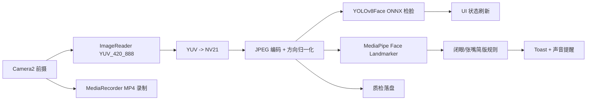

# DriveEdge Android 本地疲劳检测实现文档

## 1. 文档信息
- 项目：DriveEdge
- 模块：`edge-app`
- 版本：v0.3.0（当前仓库实现）
- 日期：2026-04-16
- 适用对象：安卓端研发、算法研发、测试

## 2. 目标与范围
本文档说明当前仓库已经打通的 Android 端本地疲劳检测链路。

### 2.1 当前包含
1. `Camera2` 前摄采集。
2. `ImageReader(YUV_420_888)` 帧获取。
3. 本地 `YOLOv8Face` 人脸检测。
4. 本地 `MediaPipe Face Landmarker` 简版疲劳分析。
5. 页面状态提示。
6. `Toast` 疲劳提示。
7. 声音告警。
8. 本地录制 MP4。
9. 质检图片落盘。

### 2.2 当前不包含
1. 云端推理主链。
2. 事件上报、离线重试、补传闭环。
3. Room 事件队列。
4. WorkManager 上传任务。
5. 头姿与复杂时序风险引擎。

## 3. 总体架构


## 4. 关键实现说明

### 4.1 页面主入口：`MainActivity`
文件：`edge-app/src/main/java/com/driveedge/app/ui/MainActivity.java`

职责：
1. 申请相机权限。
2. 打开前摄并创建 `CameraCaptureSession`。
3. 从 `ImageReader` 接收 `YUV_420_888`。
4. 转换成 `NV21` 并编码 JPEG。
5. 调用本地检测器与本地疲劳分析器。
6. 更新 UI 状态。
7. 触发疲劳告警时执行 Toast 和声音提醒。
8. 提供录制与质检目录打开入口。

### 4.2 本地人脸检测：`LocalOnnxDetector`
文件：`edge-app/src/main/java/com/driveedge/app/fatigue/LocalOnnxDetector.java`

职责：
1. 加载 `yolov8face.onnx`。
2. 执行预处理（缩放、归一化、CHW）。
3. 执行 ONNX Runtime 推理。
4. 执行置信度过滤与 NMS。
5. 将框坐标映射回原图坐标系。

### 4.3 本地疲劳分析：`LocalFatigueAnalyzer`
文件：`edge-app/src/main/java/com/driveedge/app/fatigue/LocalFatigueAnalyzer.java`

职责：
1. 加载 `face_landmarker.task`。
2. 输出脸部 blendshape 分数。
3. 计算闭眼分数与张嘴分数。
4. 用连续帧规则给出简版疲劳结论。

当前使用的主要指标：
1. `eyeBlinkLeft`
2. `eyeBlinkRight`
3. `jawOpen`

当前事件类型：
1. `normal`
2. `blink_like`
3. `mouth_open`
4. `eyes_closed`
5. `yawning`

### 4.4 声音告警
当前使用：
1. `Toast` 显示疲劳警告
2. `ToneGenerator` 播放系统告警音

设计说明：
1. 不依赖额外音频资源文件。
2. 告警有节流，避免连续刷屏和连续狂响。

### 4.5 录制与落盘
当前支持：
1. `MediaRecorder` 本地录制 MP4。
2. 质检目录落盘 JPEG。

质检子目录：
1. `probe/`
2. `raw/`
3. `enhanced/`
4. `model/`
5. `overlay/`
6. `local_detected/`

## 5. 模型与资源

### 5.1 模型文件
1. `edge-app/src/main/assets/models/yolov8face.onnx`
2. `edge-app/src/main/assets/models/face_landmarker.task`

### 5.2 当前模型作用
1. `yolov8face.onnx`
   负责人脸检测。
2. `face_landmarker.task`
   负责关键点与 blendshape 分析，用于简版疲劳判断。

## 6. UI 与交互

当前页面包含：
1. 采集状态区。
2. 疲劳状态区。
3. 相机预览区。
4. `启动采集` 按钮。
5. `停止采集` 按钮。
6. `开始录制/停止录制` 按钮。
7. `打开录制目录` 按钮。
8. `打开质检目录` 按钮。

当前不再包含：
1. 云端检测开关。
2. Web 套壳入口。
3. 云端状态显示。

## 7. 构建与调试

### 7.1 构建命令
在仓库根目录执行：

```bash
./gradlew :edge-app:assembleHostlocalDebug
./gradlew :edge-app:assembleSimulatorDebug
```

### 7.2 输出目录
1. `edge-app/build/outputs/apk/hostlocal/debug/`
2. `edge-app/build/outputs/apk/simulator/debug/`

### 7.3 质检目录
应用私有外部目录：

```text
Android/data/com.driveedge.app/files/quality_replay
```

录制目录：

```text
Android/data/com.driveedge.app/files/recordings
```

## 8. 当前疲劳规则

### 8.1 判定逻辑
满足任一条件即进入疲劳警告：
1. 连续闭眼达到阈值帧数。
2. 连续张嘴达到阈值帧数。

### 8.2 当前特点
1. 实现简单，适合本地联调。
2. 更偏工程验证，不是车规级疲劳模型。
3. 当前主要目标是“先把端侧链路跑稳、跑通、可观测”。

## 9. 已知限制
1. 当前疲劳规则较轻，误报和漏报仍需继续调。
2. 暂未加入头姿检测、长时序平滑和风险等级融合。
3. 当前声音提醒为系统音，不是自定义告警音。
4. 旧文档中的云端、ForegroundService、CameraX 等内容属于历史方案，不再代表当前主实现。

## 10. 后续建议
1. 增加头姿与低头检测。
2. 增加更稳定的时间窗口平滑。
3. 增加本地事件日志。
4. 增加告警帧专门落盘。
5. 增加更明确的红色告警 UI。
