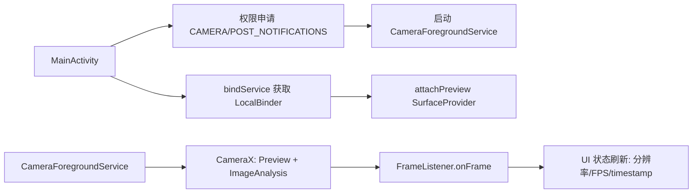

# DriveEdge Android 相机链路联调文档（ForegroundService + CameraX）

## 1. 文档信息
- 项目：DriveEdge
- 模块：`edge-app`
- 版本：v0.1.0（当前仓库实现）
- 日期：2026-04-08

## 2. 目标与范围
本文档说明当前仓库已经打通的 Android 端本地链路：
1. `ForegroundService` 常驻运行。
2. `CameraX Preview` 预览显示。
3. `ImageAnalysis` 每帧回调到业务层。

当前不包含：
1. 与服务端 API 的网络交互。
2. Room 事件队列与 WorkManager 上传重试。
3. YOLO 推理与时序引擎。

## 3. 总体架构


## 4. 关键实现说明

### 4.1 服务侧：`CameraForegroundService`
文件：`edge-app/src/main/java/com/driveedge/app/camera/CameraForegroundService.java`

职责：
1. 在 `onCreate()` 中创建通知渠道并 `startForeground()`。
2. 初始化 `ProcessCameraProvider`。
3. 根据是否有 UI 预览绑定：
   - 有预览：绑定 `Preview + ImageAnalysis`
   - 无预览：仅绑定 `ImageAnalysis`
4. 在 `ImageAnalysis` 回调里将 `ImageProxy` 转换为 `NV21`，封装成 `FrameData` 并回调 `FrameListener`。

关键点：
1. 使用 `STRATEGY_KEEP_ONLY_LATEST`，避免分析线程积压。
2. 前置摄像头：`CameraSelector.DEFAULT_FRONT_CAMERA`。
3. Service 返回 `START_STICKY`，异常场景更利于持续采集。

### 4.2 页面侧：`MainActivity`
文件：`edge-app/src/main/java/com/driveedge/app/ui/MainActivity.java`

职责：
1. 申请运行权限（`CAMERA`、Android 13+ 的 `POST_NOTIFICATIONS`）。
2. 启动并绑定前台服务。
3. 把 `PreviewView.getSurfaceProvider()` 交给服务侧 `attachPreview()`。
4. 注册 `FrameListener` 接收每帧数据并更新 UI 状态（每秒刷新一次 FPS 与帧信息）。
5. 停止时解除回调、解绑服务并发送 STOP action。

### 4.3 帧数据结构：`FrameData`
文件：`edge-app/src/main/java/com/driveedge/app/camera/FrameData.java`

字段：
1. `width` / `height`
2. `rotationDegrees`
3. `timestampNs`
4. `nv21`（字节数组）

### 4.4 清单与权限
文件：`edge-app/src/main/AndroidManifest.xml`

已声明：
1. `android.permission.CAMERA`
2. `android.permission.FOREGROUND_SERVICE`
3. `android.permission.FOREGROUND_SERVICE_CAMERA`
4. `android.permission.POST_NOTIFICATIONS`
5. `service` 的 `android:foregroundServiceType="camera"`

## 5. 构建与本地联调

### 5.1 SDK 配置
项目根目录 `local.properties`：
```properties
sdk.dir=/Users/m1ngyangg/Library/Android/sdk
```

`gradle.properties` 需包含：
```properties
android.useAndroidX=true
```

### 5.2 构建命令
在仓库根目录执行：
```bash
./gradlew :edge-app:assembleDebug -x lint
```

成功产物：
- `edge-app/build/outputs/apk/debug/edge-app-debug.apk`

### 5.3 真机联调步骤（推荐）
1. `adb devices` 确认设备在线。
2. `./gradlew :edge-app:installDebug` 安装应用。
3. 启动应用后点击“启动采集”。
4. 预期结果：
   - 预览画面显示。
   - 状态文案每秒刷新，出现 `FPS` 和 `ts`。
   - 前台通知常驻显示采集中。

常用检查命令：
```bash
adb shell dumpsys activity services | rg CameraForegroundService
```

## 6. 验收标准（当前阶段）
满足以下条件视为链路打通：
1. 前台服务可启动/停止。
2. CameraX 预览可见。
3. 每帧回调稳定触发（UI 可观测 FPS 变化）。
4. 应用切后台后服务仍保持前台通知与采集能力。

## 7. 已知限制
1. 尚未接入网络上报接口（`POST /api/v1/events`）。
2. 尚未接入事件缓存、离线重试与幂等处理。
3. 尚未集成推理模型与行为时序判定。

## 8. 下一阶段建议
1. 增加检测结果数据结构与回调总线（Frame -> Inference）。
2. 接入 Retrofit + `X-Device-Token` 鉴权上报。
3. 增加 Room + WorkManager 事件状态机（`PENDING/SENDING/SUCCESS/RETRY_WAIT/FAILED_FINAL`）。
