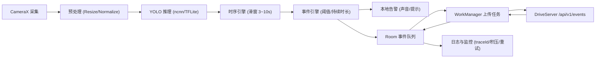
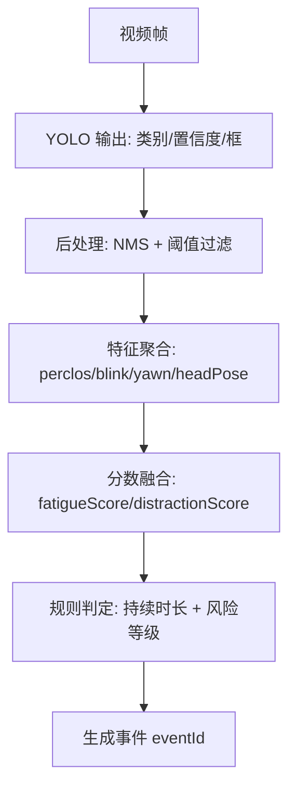
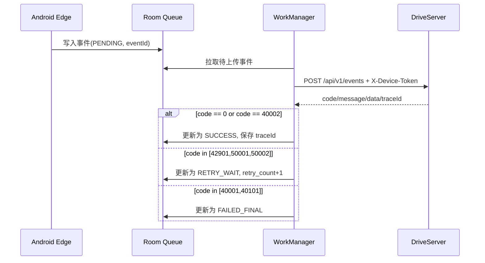
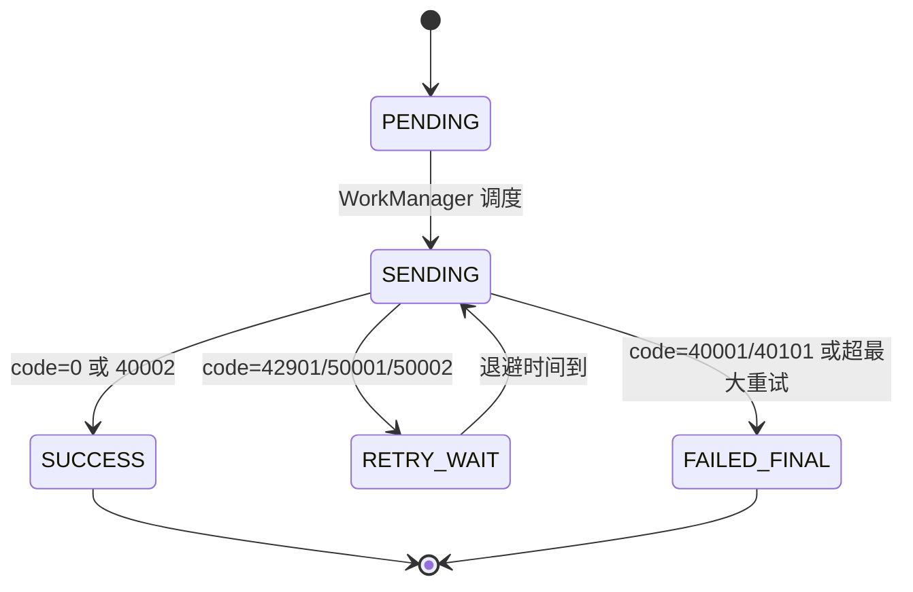

# DriveEdge 边缘层设计文档（Android + YOLO）

## 1. 文档信息
- 项目：DriveEdge（疲劳驾驶与分心检测边缘端）
- 版本：v1.0
- 日期：2026-04-07
- 适用对象：安卓端研发、算法研发、服务端研发、测试与运维

## 2. 背景与目标
本设计文档定义 DriveEdge 在安卓手机上的边缘层实现方案，目标如下：
1. 在弱网和离线环境下持续运行疲劳/分心检测。
2. 使用 YOLO 模型完成端侧检测，并通过时序规则降低误报。
3. 与 DriveServer 接口规范对齐，设备事件上报遵循文档标准。
4. 满足实时告警、数据补传、可运维与可观测要求。

## 3. 设计范围
### 3.1 本期包含
1. 安卓端视频采集、YOLO 推理、时序判定、事件上报。
2. 弱网离线队列、重试、幂等处理。
3. 与 `POST /api/v1/events` 的数据协议与错误处理策略。
4. 本地告警（声音提醒）与基础健康监控。

### 3.2 本期不包含
1. 云端规则引擎实现细节。
2. 视频片段上传接口（当前以事件数据上报为主）。
3. 多摄像头协同与跨设备联动。

## 4. 参考标准与约束
以 DriveServer 文档为标准（不是以当前后端代码实现细节为准）：
1. `DriveServer/docs/server-design/03-api-spec.md`
2. `DriveServer/docs/ingest-module.md`
3. `DriveServer/docs/auth-module.md`

关键接口约束：
1. Base URL：`/api/v1`
2. 设备上报鉴权：`X-Device-Token: <device_token>`
3. 事件上报：`POST /events`
4. 幂等键：`eventId`
5. 统一返回：`code/message/data/traceId`

## 5. 总体架构
边缘层采用“采集-推理-时序-事件-上传”流水线架构，分为 6 个模块：

1. `Capture Module`
- 基于 CameraX 采集驾驶员视频流。
- 提供固定分辨率与帧率输出（建议 720p 输入，8~12fps 推理）。

2. `Inference Module`
- 加载 YOLO 模型（ncnn 或 TFLite）。
- 输出逐帧目标检测结果（类别、置信度、框）。

3. `Temporal Engine`
- 维护 3~10 秒滑动窗口。
- 计算 `fatigueScore`、`distractionScore`、`perclos`、`blinkRate`、`yawnCount`、`headPose`。

4. `Event Engine`
- 判定是否触发疲劳/分心事件。
- 生成 `eventId` 并写入本地事件队列。

5. `Upload Module`
- 通过 `X-Device-Token` 调用 `POST /api/v1/events`。
- 按错误码执行成功确认、重试或终止策略。

6. `Storage & Ops Module`
- 使用 Room 存储事件与上传状态。
- 上报心跳、记录日志、保留 `traceId` 用于排障。

### 5.1 总体架构图

## 6. 安卓技术栈
1. 语言与架构：Kotlin + MVVM + Clean Architecture
2. 实时任务：ForegroundService + Coroutines + Flow
3. 采集：CameraX
4. 推理：YOLO（ONNX 导出后落地 ncnn；备选 TFLite INT8）
5. 本地存储：Room + DataStore
6. 网络：Retrofit + OkHttp + Kotlinx Serialization
7. 后台重试：WorkManager
8. 安全：HTTPS + Android Keystore（设备 token 加密存储）
9. 日志：结构化日志（本地）+ traceId 对账

## 7. YOLO 模型与特征设计
### 7.1 推荐检测标签
1. `eye_open`
2. `eye_closed`
3. `yawn`
4. `phone_use`
5. `head_down`
6. `head_left`
7. `head_right`
8. `no_face`

### 7.2 推理处理链路
1. 输入预处理：Resize + Normalize + RGB 转换。
2. 模型推理：输出类别、置信度、位置。
3. 后处理：NMS、置信阈值过滤、目标跟踪（可选）。
4. 时序聚合：在滑窗内计算行为统计量。

### 7.4 YOLO 到事件的数据流图

### 7.3 分数融合建议
1. `fatigueScore`：由闭眼占比（PERCLOS）、打哈欠频次、连续闭眼时长融合。
2. `distractionScore`：由低头、侧头、看手机等行为时长融合。
3. 分数范围统一归一化到 `[0,1]`。

## 8. 事件判定规则（初始阈值）
### 8.1 疲劳触发
满足任一条件触发疲劳事件：
1. `perclos >= 0.40` 且持续 `>= 3s`
2. 连续闭眼 `>= 1.5s`
3. `yawnCount >= 2` 且窗口长度 `<= 30s`

### 8.2 分心触发
满足任一条件触发分心事件：
1. `phone_use` 持续 `>= 2s`
2. `head_down/head_left/head_right` 持续 `>= 2s`
3. `no_face` 持续 `>= 2s`（仅在摄像头正常情况下生效）

### 8.3 风险等级建议
1. 低风险：`score >= 0.60`
2. 中风险：`score >= 0.75`
3. 高风险：`score >= 0.85`

注：阈值为初始值，需通过实车数据回放和误报分析迭代。

## 9. 接口与数据映射（对齐 DriveServer）
### 9.1 上报接口
- 方法：`POST`
- 路径：`/api/v1/events`
- Header：
  - `Content-Type: application/json`
  - `X-Device-Token: <device_token>`

### 9.2 请求字段映射
1. `eventId`：边缘端生成，格式建议 `evt_{vehicleId}_{yyyyMMddHHmmss}_{seq}`
2. `fleetId`：车队标识（配置下发）
3. `vehicleId`：车辆标识（设备绑定）
4. `driverId`：司机标识（登录绑定或配置）
5. `eventTime`：事件触发 UTC 时间（ISO-8601）
6. `fatigueScore`：疲劳分数 `[0,1]`
7. `distractionScore`：分心分数 `[0,1]`
8. `perclos`：闭眼占比 `[0,1]`（可选）
9. `blinkRate`：眨眼率（可选，`>=0`）
10. `yawnCount`：哈欠次数（可选，`>=0`）
11. `headPose`：头姿态枚举（可选）
12. `algorithmVer`：算法版本（例如 `yolo-v8n-int8-20260407`）

### 9.3 响应处理规则
1. `code = 0`：标记事件上传成功。
2. `code = 40002`（重复事件）：标记为成功（幂等命中）。
3. `code = 40001`：参数错误，标记失败并终止重试。
4. `code = 40101`：鉴权失败，暂停上传并触发运维告警。
5. `code = 42901/50001/50002`：进入重试队列。
6. 记录 `traceId` 到本地，支持端到端排障。

### 9.4 上报时序图

## 10. 弱网与离线策略
### 10.1 设计原则
1. 告警先本地执行，网络仅影响“上报时效”，不影响“检测能力”。
2. 事件先落盘再上传，确保断网不丢失。
3. 同一事件重试必须使用同一 `eventId`，保证幂等。

### 10.2 上传状态机
状态定义：
1. `PENDING`：待上传
2. `SENDING`：上传中
3. `SUCCESS`：上传成功
4. `RETRY_WAIT`：等待重试
5. `FAILED_FINAL`：不可重试失败

状态迁移：
1. `PENDING -> SENDING -> SUCCESS`
2. `PENDING -> SENDING -> RETRY_WAIT -> SENDING`
3. `PENDING -> SENDING -> FAILED_FINAL`

### 10.3 重试策略
1. 指数退避：`5s -> 15s -> 30s -> 60s -> 120s ...`
2. 抖动：每次退避增加随机抖动，减少并发冲击。
3. 最大重试次数：建议 `10` 次，超过后进入人工处理队列。
4. 网络约束：可配置仅在 Wi-Fi 或任意可用网络重试。

### 10.4 本地数据保留
1. 环形保留：默认 72 小时事件数据。
2. 高风险事件优先保留，普通事件按时间淘汰。
3. 存储阈值告警：空间不足时触发本地日志告警。

## 11. 本地数据模型（Room）
### 11.1 `edge_event`（事件表）
1. `event_id`（PK）
2. `fleet_id`
3. `vehicle_id`
4. `driver_id`
5. `event_time_utc`
6. `fatigue_score`
7. `distraction_score`
8. `perclos`
9. `blink_rate`
10. `yawn_count`
11. `head_pose`
12. `algorithm_ver`
13. `upload_status`
14. `retry_count`
15. `last_error_code`
16. `last_error_message`
17. `server_trace_id`
18. `created_at`
19. `updated_at`

### 11.2 `device_config`（配置表）
1. `fleet_id`
2. `vehicle_id`
3. `device_id`
4. `model_profile`
5. `threshold_profile`
6. `upload_policy`
7. `updated_at`

## 12. 性能与稳定性指标
1. 告警时延：端到端 `< 300ms`（采集到本地告警）
2. 推理帧率：`>= 8fps`
3. 运行稳定性：连续运行 `>= 8h` 不崩溃
4. 上传成功率：补传后 `>= 99%`
5. 弱网可用性：断网不影响检测与告警

## 13. 安全与隐私
1. 传输加密：仅 HTTPS。
2. 鉴权凭证：`X-Device-Token` 本地加密存储（Keystore）。
3. 最小化数据：默认只上传结构化事件，不上传全量视频。
4. 日志脱敏：token、用户敏感信息不得明文落日志。

## 14. 可观测性与运维
1. 关键日志：
   - 推理耗时
   - 事件触发明细
   - 上传请求与响应 `code/traceId`
2. 健康指标：
   - CPU/内存/温度
   - 相机状态
   - 队列积压长度
3. 故障排查：
   - 端侧 eventId + 服务端 traceId 关联检索

## 15. 版本规划
### 15.1 MVP（v1）
1. 单路摄像头
2. YOLO 检测 + 时序规则
3. 本地告警
4. 事件上报与弱网重试

### 15.2 v2
1. 规则自适应阈值
2. 远程配置热更新
3. 模型 A/B 策略切换

### 15.3 v3
1. 多模型协同
2. 证据片段上传
3. 车队级在线评估闭环

## 16. 风险与对策
1. 风险：YOLO 单帧误报高  
对策：必须启用时序规则，不直接用单帧输出告警。

2. 风险：安卓长时运行发热降频  
对策：动态降帧率、降分辨率、切换轻量模型。

3. 风险：弱网导致上传堆积  
对策：本地队列限流、重试退避、分级保留策略。

4. 风险：接口规范与服务实现暂存差异  
对策：边缘端严格按文档实现；联调时以接口契约测试为准。

## 17. 验收标准
1. 在离线 30 分钟场景下持续产生并保存事件，恢复网络后可补传成功。
2. 重复提交同一 `eventId` 不产生重复业务事件（幂等生效）。
3. `X-Device-Token` 鉴权链路联调通过。
4. 服务端返回 `traceId` 可在边缘端日志中检索到。
5. 真实路测下满足告警时延与稳定性指标。

## 18. 开发计划
### 18.1 总体节奏（6 周）
1. 第 1 周（2026-04-08 至 2026-04-14）：项目骨架与基础能力
2. 第 2 周（2026-04-15 至 2026-04-21）：YOLO 推理链路与时序特征
3. 第 3 周（2026-04-22 至 2026-04-28）：事件引擎与本地告警
4. 第 4 周（2026-04-29 至 2026-05-05）：弱网队列与上报模块
5. 第 5 周（2026-05-06 至 2026-05-12）：联调、压测与稳定性优化
6. 第 6 周（2026-05-13 至 2026-05-19）：实车验证与发布准备

### 18.2 里程碑定义
1. M1（2026-04-14）：安卓端完成采集、模型加载、单帧推理通路
2. M2（2026-04-28）：事件可触发并落盘，具备本地告警能力
3. M3（2026-05-05）：`POST /api/v1/events` 上报闭环打通（`X-Device-Token`）
4. M4（2026-05-12）：弱网重试、幂等、traceId 对账能力通过测试
5. M5（2026-05-19）：完成路测验收，进入试运行

### 18.3 分阶段任务
#### 阶段 A：基础工程（第 1 周）
1. 创建安卓项目模块：`app`、`module-capture`、`module-infer-yolo`、`module-temporal-engine`、`module-risk-engine`、`module-event-center`、`module-alert`、`module-storage`、`module-uploader`、`module-sync-worker`、`module-ops-security`
2. 打通 ForegroundService、CameraX 预览与帧回调
3. 接入 Room、WorkManager、Retrofit 基础框架
4. 落地设备鉴权基础能力：`DeviceTokenManager`（Keystore 存取）与统一请求拦截器
5. 定义统一日志格式与错误码映射

交付物：
1. 可运行 Demo（相机采集 + 前台服务常驻）
2. 模块化工程结构与基础 CI

#### 阶段 B：算法接入（第 2 周）
1. YOLO 模型导入（ncnn 或 TFLite INT8）
2. 完成预处理、后处理、NMS
3. 输出核心特征：`perclos`、`blinkRate`、`yawnCount`、`headPose`
4. 建立推理耗时统计与性能日志

交付物：
1. 端侧推理基线报告（fps、耗时、温度）
2. 检测标签与字段映射文档

#### 阶段 C：事件闭环（第 3 周）
1. 实现滑窗时序引擎（3~10 秒）
2. 实现疲劳/分心事件判定与风险等级
3. 接入本地告警（声音/提示）
4. 事件入库（`edge_event`）与状态初始化

交付物：
1. 事件触发回放视频与日志证据
2. 阈值初始参数文件

#### 阶段 D：弱网上报（第 4 周）
1. 对接 `POST /api/v1/events`
2. `module-uploader` 请求头启用 `X-Device-Token`
3. 实现上传状态机：`PENDING/SENDING/RETRY_WAIT/SUCCESS/FAILED_FINAL`
4. 按 `code` 处理成功、重试与终止
5. 打通鉴权异常分支：`40101` 时 `module-sync-worker` 暂停上传并触发告警事件

交付物：
1. 断网-恢复补传演示
2. 幂等冲突（`40002`）测试结果

#### 阶段 E：联调优化（第 5 周）
1. DriveServer 联调（统一响应、traceId 对账）
2. 压测弱网场景（高丢包、高延迟、抖动）
3. 长稳测试（8 小时连续运行）
4. 发热与功耗优化（降帧率、降分辨率、轻量模型切换）

交付物：
1. 联调问题清单与关闭记录
2. 性能优化报告与参数建议

#### 阶段 F：路测发布（第 6 周）
1. 实车场景测试（白天/夜间/颠簸/遮挡）
2. 误报漏报分析与阈值微调
3. 版本冻结与发布包验收
4. 运维手册与故障排查手册交付

交付物：
1. 验收报告（含指标达成情况）
2. 发布说明与回滚预案

### 18.4 角色分工建议
1. 安卓研发：采集、推理接入、时序引擎、上传状态机、设备鉴权
2. 算法研发：模型导出、标签定义、阈值策略、精度评估
3. 服务端研发：接口联调支持、鉴权与幂等验证、问题定位
4. 测试：功能、弱网、稳定性、路测验收
5. 运维：配置管理、日志采集、发布与回滚保障

### 18.5 测试计划
1. 单元测试：字段映射、规则判定、重试策略
2. 集成测试：端到端上报、幂等冲突、鉴权失败处理
3. 弱网测试：断网、限速、丢包、间歇可用
4. 回归测试：每周里程碑后执行全链路回归

### 18.6 模块级开发排期（更新）
#### 第 1 周（2026-04-08 至 2026-04-14）
1. `module-capture`：相机采集与帧输出
2. `module-infer-yolo`：模型加载骨架、推理接口定义
3. `module-storage`：Room 表建模与 DAO
4. `module-ops-security`：`DeviceTokenManager` 与 Keystore
5. `module-uploader`：HTTP 客户端骨架与统一响应解析

交付物：
1. 可运行框架与模块骨架
2. `X-Device-Token` 本地存储与读取能力可用

#### 第 2 周（2026-04-15 至 2026-04-21）
1. `module-infer-yolo`：预处理、后处理、NMS
2. `module-temporal-engine`：滑窗聚合与特征计算
3. `module-risk-engine`：分数融合公式与阈值策略

交付物：
1. 单帧检测结果稳定输出
2. `perclos/blinkRate/yawnCount/headPose` 可计算

#### 第 3 周（2026-04-22 至 2026-04-28）
1. `module-event-center`：事件去抖与 `eventId` 生成
2. `module-alert`：本地告警与节流
3. `module-storage`：事件状态初始化（`PENDING`）

交付物：
1. 事件触发到落盘闭环
2. 本地告警策略可配置

#### 第 4 周（2026-04-29 至 2026-05-05）
1. `module-uploader`：`POST /api/v1/events` 对接
2. `module-sync-worker`：重试退避、网络约束、状态机流转
3. `module-ops-security`：鉴权失败（`40101`）处理与告警

交付物：
1. `X-Device-Token` 上报联调通过
2. 弱网补传与幂等（`40002`）验证通过

#### 第 5 周（2026-05-06 至 2026-05-12）
1. 全模块联调与问题清零
2. 压测与长稳测试
3. 性能和发热优化

交付物：
1. 联调缺陷关闭率达到目标
2. 8 小时稳定性报告

#### 第 6 周（2026-05-13 至 2026-05-19）
1. 实车验证与阈值微调
2. 发布包制作、回滚验证
3. 交付运维与排障文档

交付物：
1. 上线候选版本（RC）
2. 发布与回滚演练记录

### 18.7 鉴权专项任务（新增）
1. 设备 token 生命周期：
   - 发放：由运维平台或初始化流程写入
   - 存储：Keystore 加密保存
   - 使用：`module-uploader` 每次请求自动注入 `X-Device-Token`
   - 失效：命中 `40101` 后暂停上传并进入告警流程
2. 鉴权专项测试：
   - 正常 token：上报成功
   - 过期 token：返回 `40101`，队列暂停
   - 空 token：请求被拒绝，事件不丢失
3. 鉴权验收标准：
   - 异常 token 不导致事件丢失
   - 恢复有效 token 后可继续补传

### 18.8 风险前置检查点
1. 2026-04-14：模型端性能是否满足 `>=8fps`
2. 2026-04-28：误报率是否在可控范围
3. 2026-05-05：`X-Device-Token` 联调是否完全通过
4. 2026-05-12：弱网补传成功率是否达到目标

### 18.9 发布准入条件
1. 功能验收标准（第 17 章）全部通过
2. 长稳运行 8 小时无崩溃
3. 弱网补传成功率 `>=99%`
4. 关键问题（P1/P0）清零
